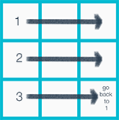

# Game

As a first java project ever, I did a robots game. There is 2 kinds of robots : polluters and cleaners.
Polluters have to pollute cell and cleaners have to ... clean it.

I adapted this game by replacing robots by marvel superheros :)  

 
 

# Heroes

###### Iron Man
_"I'm Iron Man."_  

 
 
###### Loki
_"Loki is unpredictable, he can spawn everywhere !"_   

  

###### Hulk
_"Because Hulk is angry, He can't do anything but go straight."_   

  

###### Ultron
_"Ultron is smart, he can move like knights in chess."_   

env variable
width
height
speed

### Block free

Robots move in such a way that they can block each others. You can try for example with 1ms as refresh time, they will never block.

### TroubleShouting :

Error: Could not find or load main class org.robots.models.World
  -> CLASSPATH=/path/to/project/Robots/src; export CLASSPATH;
