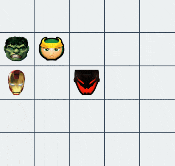

# Game

As a first java project ever, I did a robots game. There is 2 kinds of robots : polluters and cleaners.
Polluters have to pollute cell and cleaners have to ... clean it.

I adapted this game by replacing robots by marvel superheros :)  

 

# Heroes

###### Iron Man
_"I'm Iron Man."_

###### Loki
_"Loki is unpredictable, he can spawn everywhere !"_

###### Hulk
_"Because Hulk is angry, He can't do anything but go straight."_

###### Ultron
_"Ultron is smart, he can move like knights in chess."_

  

# Project

### Environment variable
You can manually specify world's width, height and refresh time while lauching the program.

__For example :__ ``java org.robots.models.World 8 5 100`` will initialize a world with the
following parameters :

+ width : 8 (default 7)
+ height : 5 (default 7)
+ refresh time : 100ms (default 1000ms)

### Usage
In /src/org/robots :
1. ``javac */**.java``
2. ``java org.robots.models.World {width} {height} {refreshTime}``

### Block free

Robots move in such a way that they can block each others. You can try for example with 1ms as refresh time, they will never block.

### Troubleshooting :

"Error: Could not find or load main class org.robots.models.World"
  -> CLASSPATH=/path/to/project/Robots/src; export CLASSPATH;
